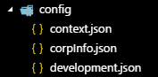
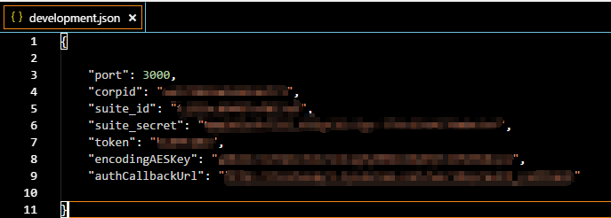

# 微信企业Demo
## 该项目是企业微信第三方应用授权--从服务商网站发起授权的Demo
    企业进入应用提供商网站（就是你公司的网站）
    应用提供商通过api获取预授权码
    应用提供商引导企业系统管理员进入应用套件授权页
    企业号管理员确认并同意授权托管给应用提供商
    授权成功，返回临时授权码
    利用临时授权码获取永久授权码以及授权信息
    后续可以通过永久授权码调用企业号相关API

## 微信服务器会向套件的“系统事件接收URL”定时（每十分钟）推送ticket，开发者需保存下来

## 另外config文件夹请自行创建  
  
  

### 作者：郝雪冰  
### QQ：949096562 

### 请我喝杯咖啡

